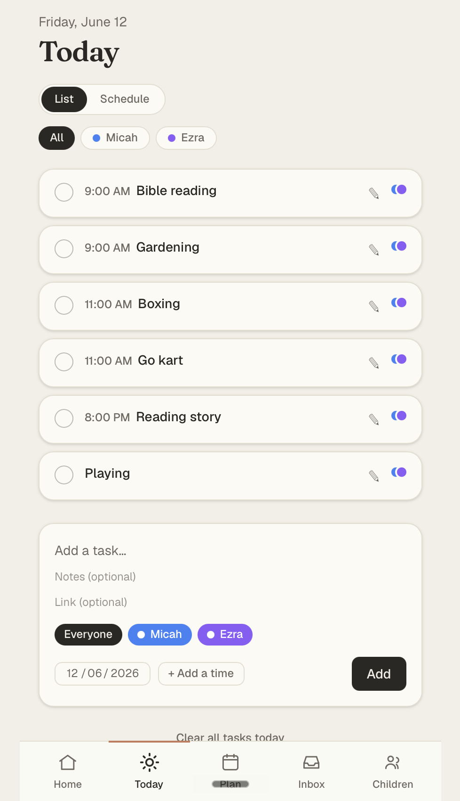

# Homeschool Hub



A calm planning tool for newcomer homeschooling parents. It acts as a trusted
"external brain" built around a weekly rhythm — **capture** ideas, **plan** the
week, **see today**, **check it off** — so a parent can lean on it the way they
lean on a calendar.

## Why I built it

Most homeschooling tools are heavy gradebooks built for veterans. The first
person I built this for is a brand-new homeschooling parent who just needs to
know *what are we doing today?* without being nagged about what slipped. So
Homeschool Hub is deliberately gentle: unfinished tasks quietly stay on their
day instead of turning red, the Inbox is meant to *drain* into a plan rather
than grow into a library, and a quiet week is met with warmth, not a score.
It's also a long-term project for my own future family.

## Features

- **Google sign-in** — one-tap auth; every parent only ever sees their own data.
- **Children** — lightweight colored tags used to assign and filter activities.
- **Inbox** — capture an idea or link in one step (a bare URL is valid), then
  plan it into the week. Planning drains it out of the Inbox.
- **Plan / Today** — schedule activities for any day, with optional time blocks,
  and check them off. An hourly schedule view renders timed tasks as real blocks.
- **Recap** — a warm weekly summary of what got done and who did it.
- **Full CRUD** on children, tasks, and inbox resources, all owner-scoped.

## Getting started

- **Live app:** https://homeschool-hub-three.vercel.app
- **Planning materials:** [`CONTEXT.md`](CONTEXT.md) (domain language and product
  shape) and the Architecture Decision Records in [`docs/adr/`](docs/adr)
- **Repository:** This is a single full-stack Next.js app, so the front-end and
  back-end live in **one repository** (this one). The server lives in
  `src/app/**/actions.ts` (Server Actions), `src/data/**` (the data layer), and
  `src/app/api/**` (route handlers); the React UI lives in `src/app/**` and
  `src/components/**`.

### Run locally

```bash
npm install
cp .env.local.example .env.local   # then fill in the values below
npx prisma migrate dev             # set up the database schema
npm run dev                        # http://localhost:3000
```

Requires a local PostgreSQL database and Google OAuth credentials. Set
`DATABASE_URL`, `DIRECT_URL`, `GOOGLE_CLIENT_ID`, `GOOGLE_CLIENT_SECRET`, and
`AUTH_SECRET` in `.env.local`.

## Technologies used

- **TypeScript**
- **Next.js 16** (App Router, React Server Components, Server Actions)
- **React 19**
- **Auth.js / NextAuth** with Google OAuth (database sessions)
- **Prisma** ORM
- **PostgreSQL** (Neon in production)
- **Tailwind CSS v4**
- **Vitest** for testing
- Deployed on **Vercel**

## Next steps

- **Kid Mode** — kids view and complete their own tasks while the parent stays
  the sole editor (no kid logins).
- **Dark mode** — the design foundation is light-only for now.
- **Recurring plans** — richer repeat rules when turning a Resource into Tasks.
- **Multi-week planning** — see and shape more than one week at a time.

## Attributions

- Fonts: [Geist](https://vercel.com/font) (sans/mono) and
  [Fraunces](https://fonts.google.com/specimen/Fraunces) (display serif).
